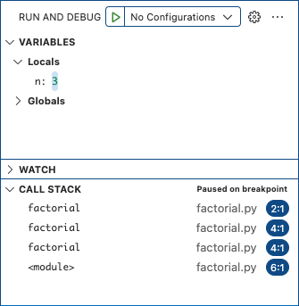

# Recursion
## Overview
A *recursive* method is one that calls itself. This is useful for algorithms that can naturally be expressed in terms of solving a problem by first solving an easier problem.

For example, suppose we want to compute $n!$ (pronounced "$`n`$ factorial"), which is the product of the first $n$ positive integers.

Here is a recursive solution:
```python
def factorial(n):
    if n == 1:
        return 1
    return n * factorial(n - 1)
```

The first part, called the *base case*, directly solves a simple problem: $n! = 1$.

The second part, the *recursive case*, solves the simpler problem of computing $(n - 1)!$, then multiplies that result by $n$ to find $n!$.

This may seem like a strange way to solve the problem. You should be able to devise a less confusing (and slightly more efficient) algorithm to find the same result using *iteration* (a [loop](loops.md)). In fact, anything that can be done with iteration can be done with recursion, and vice versa.

Why, then, should you wrap your head around recursion? Some algorithms are much more naturally expressed using recursion. For example, consider the [Towers of Hanoi](https://www.mathsisfun.com/games/towerofhanoi.html) puzzle, which seeks to move `n` disks from peg `start` to peg `end`, using peg `spare` for temporary storage. A *divide and conquer* algorithm first recursively moves `n - 1` disks to `spare`, then moves the largest disk to `end`, and finally recursively moves `n - 1` disks from `spare` to `end`.
```python
def hanoi(start, spare, end, n):
    if n == 1:
        print(start + ' -> ' + end)
    else:
        hanoi(start, end, spare, n - 1)
        print(start + ' -> ' + end)
        hanoi(spare, start, end, n - 1)
```

Solving this problem using iteration would be considerably more difficult.

## How It Works
Many students scratch their heads when first encountering recursion. Isn't it circular logic to define a method in terms of itself? Won't it go into some kind of infinite loop?

To see your way out of this difficulty, remember [the call stack](functional_decomposition.md#the-call-stack). Every time a method is called, the current method is frozen and a new call frame is pushed onto the stack. The only special thing about recursion is that several of these call frames are for the same method. Each one has its own version of any local variables (including arguments) and its own memory of where it was frozen.

As an example, suppose you run this program in Visual Studio Code's debugger, with a breakpoint at the beginning of `factorial`:
```python
def factorial(n):
    if n == 1:
        return 1
    return n * factorial(n - 1)

print(factorial(5))
```

After a few steps, the call stack looks like this:



The bottom call frame corresponds to the call to `factorial(5)` in the global scope at the bottom of our little program.  `factorial(5)` called `factorial(4)`, which called `factorial(3)`, the current call frame.

This doesn't lead to an infinite loop because you eventually hit the base case, which does not make another recursive call. After it finishes, the top frame is popped off and the frame below picks up where it left off.

For a method with multiple recursive calls, like `hanoi`, the call stack can grow and shrink several times, but the process eventually ends.

If a recursive method doesn't include a base case, or the recursive calls don't get closer to a base case, the call stack *will* grow until the system runs out of memory, at which point the system will crash. This is called a *stack overflow*.

## Thinking Recursively
When solving a problem recursively, start by solving a very simple instance ($n = 1$, the empty string, etc.). Then solve a slightly harder one. After you have several solutions, see if you find a rule connecting each one to the solution to a simpler problem. A side bonus of this approach is that your solutions make good [test](../software_development/testing.md) cases.

Every recursive method must have at least one base case and at least one recursive case.

Recursive calls must get closer to the base case to avoid a stack overflow.

While working through the call stack is sometimes useful for debugging, it's often best to instead think about *solving a problem in terms of easier problems*. If your base case works correctly, it's okay to make a "leap of faith" and *assume* that your method works correctly for smaller problems.

Simple recursive methods don't involve loops. Some more complicated ones might use a loop to make recursive calls for several easier problems.

## Resource
- Sedgewick, Wayne, and Dondero, *Introduction to Programming in Python*, [Section 2.3](https://introcs.cs.princeton.edu/python/23recursion/)

## Questions
1. :star: What happens if a recursive function with no base case is called?
1. :star: What happens if a recursive function with two base cases is called?
1. :star: When is recursion preferable to iteration (using loops)?
1. :star::star: Assuming non-negative integer arguments, what does the function below compute?
    ```
    def v(a, b):
        if a == 0:
            return b
        return 1 + v(a - 1, b)
    ```
1. :star::star: Assuming non-negative integer arguments, what does the function below compute?
    ```
    def w(a, b):
        if a == 0:
            return 0
        if a == 1:
            return b
        return b + w(a - 1, b)
    ```
1. :star::star: Assuming non-negative integer arguments, what does the function below compute?
    ```
    def x(a, b):
        if a == 0:
            return 0
        if a % 2 == 0:
            return     x(a // 2, b * 2)
        else:
            return b + x(a // 2, b * 2)
    ```
1. :star::star: Assuming non-negative integer arguments, what does the function below compute?
    ```
    def y(a, b):
        if b == 0:
            return 1
        if a == 0:
            return 0
        return a * y(a, b - 1)
    ```
1. :star::star: Assuming non-negative integer arguments, what does the function below compute?
    ```
    def z(a, b):
        if b == 0:
            return 1
        if a == 0:
            return 0
        if b % 2 == 0:
            return     z(a * a, b // 2)
        else:
            return a * z(a * a, b // 2)
    ```
1. :star::star: Given the code below, under what conditions does `check(s)` return `True`?
    ```python
    def _check(s, lo, hi):
        if hi - lo <= 1:
            return True
        return s[lo] == s[hi - 1] and _check(s, lo + 1, hi - 1)

    def check(s):
        return _check(s, 0, len(s))
    ```
1. :star::star: Give a recursive implementation for computing the *n*th element of the Fibonacci sequence.
1. :star::star::star: Give a recursive implementation for computing the *n*th element of the Fibonacci sequence that avoids unnecessary recomputations.
1. :star::star::star: Give a recursive implementation for computing the *n*th element of the Fibonacci sequence that takes time in $\Theta(n)$ and avoids remembering the result of previous computations.
1. :star::star::star: Recursion revolves around a base case and a step from one input to a slightly larger input. What mathematical proof technique uses this same idea?
1. :star::star::star: How many computation steps does it take to solve the Towers of Hanoi problem with $n$ disks?
1. :star::star::star::star: When is a function said to be tail recursive?

## Answers
1. It keeps calling itself until the call stack fills up all available memory, at which point the program crashes. This is called a stack overflow.
1. It is fine. At least one base case is needed, but occasionally more than one is required.
1. Some algorithms are much more clearly stated using recursion rather than iteration. These are algorithms that solve a problem by first solving one or more easier problems. In general, if you can find a way to express your algorithm iteratively, do that; if, in trying to do this, you find that you need to remember work to do after solving the easier problem, recursion will probably be easier.
1. The sum of `a` and `b` computed with trivial increments and decrements only.
1. The product of `a` and `b` computed with additions only; this function takes time in $\Theta(a)$.
1. The product of `a` and `b` computed with the [Russian Peasant multiplication method](https://en.wikipedia.org/wiki/Ancient_Egyptian_multiplication) which uses additions and trivial shifts only; this function takes time in $\Theta(\log a)$.
1. `a` raised to the power of `b` computed with multiplications only; this function takes time in $\Theta(b)$.
1. `a` raised to the power of `b` computed with multiplications and integer divisions only; this function takes time in $\Theta(\log b)$.
1. `s` is a palindrome (that is, reads the same forward and backward).
1. This function is a straight implementation of the defining recurrence relation.
   ```python
   def fib(n):
       if n == 0:
           return 0
       if n == 1:
           return 1
       return fib(n - 1) + fib(n - 2)
   ```
   This function takes time in $\Theta(2^n)$.
1. This implementation uses [memoization](https://en.wikipedia.org/wiki/Memoization), a form of dynamic programming, where you store the result of a computation for later reuse.
   ```python
   _fib_cache = {0: 0, 1: 1}
   def fib(n):
       if n in _fib_cache:
           return _fib_cache[n]
       _fib_cache[n] = fib(n - 1) + fib(n - 2)
       return _fib_cache[n]
   ```
   This function takes time and space in $\Theta(n)$.
1. This implementation relies on a helper function.
   ```python
   def _fib_helper(n, a, b):
       if n == 0:
           return a
       if n == 1:
           return b
       return _fib_helper(n - 1, b, a + b)

   def fib(n):
       return _fib_helper(n, 0, 1)
   ```
   This implementation takes time in $\Theta(n)$, and space in $\Theta(1)$ with [tail call elimination](https://en.wikipedia.org/wiki/Tail_call).
1. Induction.
1. $T(n)=2^n-1$. It is the closed-form solution to the recurrence relation $`T(n)=2*T(n-1)+1`$. The relation is derived from the timing analysis of the recursive case of the function definition. That case calls itself twice recursively ($`2*T(n-1)`$) and prints a string ($+1$).
1. A function is tail recursive when the last action it performs is the recursive call. It is a special case of recursive functions. It is an important special case as it enables [tail call elimination](https://en.wikipedia.org/wiki/Tail_call) essentially converting a recursion into an iteration. [Python does not normally perform this optimization](https://stackoverflow.com/questions/13591970/does-python-optimize-tail-recursion), but [it can be done](https://chrispenner.ca/posts/python-tail-recursion).
