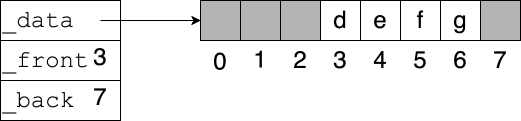
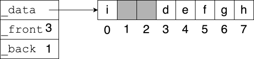

# Array-Based Structures
## Overview
Python uses lists as its default linear structures. Lower-level languages like C instead use primitive arrays. Key differences include:
- An array's size is set when it is created; it cannot change.
- Python list features, such as slicing and methods like the `count` method, are not directly available for primitive arrays.

This page describes how to build various linear structures out of [Python lists masquerading as] primitive arrays. While you would normally just use Python's lists, sets, and so on, this is worthy of study because:
- Understanding the underlying data structures and algorithms clarifies the performance of Python's fancier data structures. For example, it will help you understand why adding something to the *beginning* of a long list is much more expensive than adding something to the *end*.
- You may someday be working in a language that uses primitive arrays.
- You may need to build a data structure that is slightly different from what Python provides.

Many of these data structures can also be implemented using other techniques, such as [linked lists](linked_lists.md) and hash tables.

## Simulating Primitive Arrays
To use Python's convenient list syntax while limiting yourself to what a primitive array can do, use only the following features:

Operation|Syntax
-|-
Allocate an array of length $n$|`a = [None] * n`
Access element $i$|`a[i]`
Set element $i$ to $x$|`a[i] = x`
Get the length of an array|`len(a)`

All of these operations clearly take constant time except allocation which, as defined above, takes linear time.  Note that in C you can allocate an array in constant time, but its content is not initialized, creating a security risk.

To iterate through a primitive array, use the following syntax:

```python
for i in range(len(a)):
    # Do something with a[i]
```

If, for efficiency reasons, you want an actual primitive array, use Python's `numpy` library.

## Stacks
```python
class ArrayStack:

    def __init__(self):
        self._data = [None]
        self._size = 0

    def push(self, item):
        if self._size == len(self._data):
            self._expand()
        self._data[self._size] = item
        self._size += 1

    def pop(self):
        self._size -= 1
        return self._data[self._size]

    def is_empty(self):
        return self._size == 0

    def _expand(self):
        new_data = [None] * self._size * 2
        for i in range(self._size):
            new_data[i] = self._data[i]
        self._data = new_data

```

The class `ArrayStack` has two attributes, `_data` and `_size`. `_data` is a primitive array holding the items on the stack. To allow the stack to grow and shrink without resizing the array on every access, the capacity of `_data` may be larger than the current height of the stack. `_size` indicates how much of the array is actually part of the stack. It is also useful as the index of the next available slot in the array.

For example, an `ArrayStack` with capacity for 8 items, but currently only holding 5, would look like this:


This simple implementation's behavior is undefined if a user pops an empty stack (which they should have detected by calling `is_empty`). A more robust implementation would throw an `EmptyStackException` instead.

### Resizing the data array
What if a user pushes something onto a stack that is full? Stacks should behave as if they have unlimited capacity. In this situation, the `_expand` method copies the data into a larger array, which then replaces `_data`.


The new array is not merely one slot larger but *twice* as large, keeping the amortized running time of `push` constant.

## Queues
```python
class ArrayQueue:

    def __init__(self):
        self._data = [None]
        self._front = 0
        self._back = 0

    def dequeue(self):
        result = self._data[self._front]
        self._front = (self._front + 1) % len(self._data)
        return result

    def enqueue(self, item):
        if (self._back + 1) % len(self._data) == self._front:
            self._expand()
        self._data[self._back] = item
        self._back = (self._back + 1) % len(self._data)

    def is_empty(self):
        return self._front == self._back

    def _expand(self):
        n = len(self._data)
        new_data = [None] * n * 2
        for i in range(n - 1):
            new_data[i] = self._data[(self._front + i) % n]
        self._front = 0
        self._back = n - 1
        self._data = new_data
```

`ArrayQueue` is similar to `ArrayStack`, with the front of the queue at index 0, but there are complications.

Enqueuing works just like pushing at first. To dequeue, you need to return the item at index 0, but then what? You could shift everything over (and decrement `_size`) so that that the queue begins at index 0, but that would take linear time. A better solution is to maintain two numbers, `_front` and `_back`. The front item is at index `_front` and the next available index is `_back`.

This approach causes another problem: after a series of enqueue and dequeue operations, the queue will march down the array, so the indices close to 0 are unused but unavailable.



To avoid wasting space, the queue is made to wrap around to the beginning. Here is the queue above after enqueueing two more items:



The last detail is that a full queue (requiring copying everything into a larger array) and an empty queue would look exactly the same: `_front == _back`. The solution is to store at most $n - 1$ items in an array of length $n$.

## Lists
Replicating all of the features of a Python list would require a great deal of code, but the `ArrayList` class below provides basic functionality. It is similar to `ArrayStack`.

```python
class ArrayList:

    def __init__(self):
        self._data = [None]
        self._size = 0

    def __getitem__(self, index):
        return self._data[index]

    def __setitem__(self, index, item):
        self._data[index] = item

    def __len__(self):
        return self._size

    def __str__(self):
        result = '<'
        if self._size > 0:
            result += self._data[0]
        for i in range(1, self._size):
            result += ', ' + self._data[i]
        return result + '>'

    def add_at(self, index, item):
        if self._size == len(self._data):
            self._expand()
        for j in range(self._size, index, -1):
            self._data[j] = self._data[j - 1]
        self._data[index] = item
        self._size += 1

    def remove_at(self, index):
        for j in range(index, self._size - 1):
            self._data[j] = self._data[j + 1]
        self._size -= 1

    def _expand(self):
        new_data = [None] * self._size * 2
        for i in range(self._size):
            new_data[i] = self._data[i]
        self._data = new_data
```

The `__getitem__` and `__setitem__` magic methods allow elements of an `ArrayList` to be accessed using the usual square brackets. For example, you can say things like `a[2] = 100`. `__len__` and `__str__` make `len` and `str` work.

The `add_at` and `remove_at` methods insert and remove an item from the list, respectively. Since these potentially require shifting over all of the existing items (e.g., when adding an item at index 0), they take linear time in the worst case.

Sets and dictionaries can be implemented using similar techniques. If better runtime behavior is required, data structures such as hash tables might be preferred.

## Resource
- Sedgewick & Wayne, *Introduction to Programming in Python*, [Chapter 4](https://introcs.cs.princeton.edu/python/40algorithms/)

## Questions
1. :star: Which methods from `ArrayStack` take linear time in the worst case?
1. :star: Which methods from `ArrayList` take linear time in the worst case?
1. :star: If `ArrayList` `ls` has length `n`, which is faster: `ls.remove_at(0)` or `ls.remove_at(n - 1)`?
1. :star::star: As the code is written, what happens if you pop an empty `ArrayStack`?
1. :star::star: When an item is popped from an `ArrayStack`, there is still a reference to it in `self._data`. Doesn't this take up memory?
1. :star::star::star: If you enqueued many items into an `ArrayQueue`, then dequeued them, `self._data` would be very large, even though none of it is in use. How can this waste of memory be prevented?

## Answers
1. `push`, but its amortized time is constant.
1. `add_at`, `remove_at`, and `__str__`.
1. `ls.remove_at(n - 1)`, because it doesn't need to shift any items.
1. `self._size` is decremented to -1 and the *last* element of `self._data` (which is not part of the stack) is returned.
1. Yes -- this is called *loitering*. A more robust implementation would set this element to `None` so the garbage collector can reclaim the item. Removing an item from an `ArrayQueue` or `ArrayList` has the same issue.
1. Modify `pop` to resize the array if it is too empty. By cutting the array capacity in half when it is less than a quarter full, the amortized time for both `push` and `pop` remains constant.
