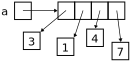
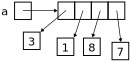

# Arrays
## Initializing Arrays
The simplest way to create an array in Python is to assign a variable a composite literal consisting of a comma-separated list of values between a pair of square brackets:
```python
a = [3, 1, 4, 7]
```
While the distinction is irrelevant in *most* situations, it's best to think of the array variable as holding a *reference to* a sequence of *references* to values contained in the array:



You can initialize an array with values other than integers.
```python
names = ['Akiko', 'Bob', 'Ciara']
truths = [True, True, False]
temps = [73.8, 82.3, 83.0]
```
## Indexing
Array elements are numbered *starting at 0*. Thus, `a[0]` is the first element of `a`, `a[1]` is the second, and so on.

You can use this to access or change any element of an array. If we take our array above and set:
```python
arr[2] = 8
```
then the array looks like this:



The expression `len(a)` returns the length of the array (which in this case is 4).

## Multidimensional Arrays
A structure like a matrix or a checkerboard can be represented by a multidimensional array. Such an array can be created using multiple pairs of square brackets:
```python
m = [[3, 1, 5, 1],
     [8, 3, 6, 0],
     [5, 3, 9, 2]]
```
To access a particular element of the two-dimensional array `m`, you specify first the row, then the column. For instance, the expression `m[1][2]` refers to the value `6` in the array.

## Slices
*Slicing* is the action of getting a *copy* of a contiguous sequence of elements within an array into a new array. For instance, the expression `a[i:j]` returns a new array whose elements are `a[i]`, `a[i + 1]`, `a[i + 2]`, ..., `a[j - 1]`. If you omit the first argument of the slice (i.e., `a[:j]`), then you get a new array whose elements are `a[0]` through `a[j - 1]`. Likewise, if you omit second argument (i.e., `a[i:]`), then you get a new array with elements `a[i]` through `a[len(a) - 1]`.

## Resource
- Sedgewick, Wayne, and Dondero, *Introduction to Programming in Python*, [Section 1.4](https://introcs.cs.princeton.edu/python/14array/)

## Questions
1. :star: Can an array have length 0?
1. :star: What is the index of the *last* element of an array `arr`?
1. :star: Given
    ```python
    m = [[0, 0], [0, 0], [0,0]]
    ```
    what is `len(m)`?
1. :star: Given
    ```python
    m = [[0, 0], [0, 0], [0,0]]
    ```
    what is `len(m[0])`?
1. :star: How would you initialize a three-dimensional array of floats?
1. :star: How many elements are in a two-dimensional array with seven rows and five columns?
1. :star: Is there a good way to remember that it's rows, columns and not the other way around?
1. :star: How can you determine the number of *columns* in a two-dimensional array `m`?
1. :star: Assuming `m` is an array, what is the result of evaluating the expression `m[:]`
1. :star: How do I get a new array whose elements are copies of the first three elements of array `m`?
1. :star: How do I get a new array whose elements are copies of the last three elements of array `m`?

## Answers
1. Yes, `len([])` is zero.
1. `len(arr) - 1`. This is because indices start at 0; if there are 10 elements, they are numbered 0 through 9.
1. 3, which is the number of rows.
1. 2, which is the number of columns.
1. With three levels of nested square brackets.
1. 35, which is the product of the dimensions.
1. Think of a can of [RC Cola](https://en.wikipedia.org/wiki/RC_Cola).
1. `len(m[0])`.
1. You get a new array whose elements are a copy of the entire contents of array `m`.
1. `m[:3]`
1. `m[len(m) - 3:]`
