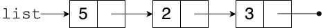

# Linked Lists
## Overview
Linear structures like stacks, queues, and lists can be implemented using either [arrays](array_based.md) or linked data structures. A linked list is a chain of node objects, each of which holds one item and knows about the next node (if there is one).



## The Node Class

If you define the `Node` class as

```python
class Node:
    def __init__(self, item, next):
        self.item = item
        self.next = next
```

then the list in the diagram above could be created by the following code:

```python
c = Node(3, None)
b = Node(2, c)
a = Node(5, b)
list = a
```

(The temporary variables `a`, `b`, and `c` are not shown in the diagram.) Note that `c`'s `next` instance variable is set to `None`, indicating that there is no next node.

A linked list is a [recursive](../control_structures/recursion.md) data structure, in that a linked list is either:
- empty (represented as `None`), or
- an item and a reference to another linked list.

## Stacks

Assuming `Node` has already been defined as above, `LinkedStack` can be defined like this:

```python
class LinkedStack:
    def __init__(self):
        self._top = None

    def push(self, item):
        self._top = Node(item, self._top)

    def pop(self):
        result = self._top.item
        self._top = self._top.next
        return result

    def is_empty(self):
        return self._top is None
```

The `LinkedStack`'s sole attribute, `_top`, refers to either the top node in the stack or (if the stack is empty) `None`.

For example, the stack

`5`<br>`2`<br>`7`

would be represented like this:

TODO DIAGRAM

## Queues

```python
class LinkedQueue:
    def __init__(self):
        self._front = None
        self._back = None

    def enqueue(self, item):
        if self._front:
            self._back.next = Node(item, None)
            self._back = self._back.next
        else:
            self._front = Node(item, None)
            self._back = self._front

    def dequeue(self):
        result = self._front.item
        self._front = self._front.next
        if self._front is None:
            self._back = None
        return result

    def is_empty(self):
        return self._front is None
```

`LinkedQueue` is similar to `LinkedStack`, but it keeps track of both the front and the back of the queue.

The queue

`5` `2` `7`

would be represented like this:

TODO DIAGRAM

`dequeue` works just like `pop`, but must handle the special case of the dequeuing the *last* item. `enqueue` modifies the last node and must account for the possibility that the queue was previously empty.

## Lists

Replicating all of the features of a Python list would require a great deal of code, but the `LinkedList` class below provides basic functionality. It is similar to `LinkedStack`.

```python
class LinkedList:
    def __init__(self):
        self._front = None

    def __getitem__(self, index):
        node = self._front
        for i in range(index):
            node = node.next
        return node.item

    def __setitem__(self, index, item):
        node = self._front
        for i in range(index):
            node = node.next
        node.item = item

    def __len__(self):
        node = self._front
        result = 0
        while node:
            result += 1
            node = node.next
        return result

    def __str__(self):
        result = '<'
        if self._front:
            result += self._front.item
            node = self._front.next
            while node:
                result += ', ' + node.item
                node = node.next
        return result + '>'

    def add_at(self, index, item):
        if index == 0:
            self._front = Node(item, self._front)
        else:
            node = self._front
            for i in range(index - 1):
                node = node.next
            node.next = Node(item, node.next)

    def remove_at(self, index):
        if index == 0:
            self._front = self._front.next
        else:
            node = self._front
            for i in range(index - 1):
                node = node.next
            node.next = node.next.next
```

The `__getitem__` and `__setitem__` magic methods allow elements of a `LinkedList` to be accessed using the usual square brackets. For example, you can say things like `a[2] = 100`. `__len__` and `__str__` make `len` and `str` work.

Since many of these methods require "walking down" the list, they take linear time in the worst case.

Sets and dictionaries can be implemented using similar techniques. If better runtime behavior is required, data structures such as hash tables might be preferred.

## Array-Based vs Linked Structures

*All other things being equal*, array-based implementations are considered better for building general-purpose data structures. Linked structures are useful in some specific circumstances. Practicing with linked lists is also important because trees generally require linked structures.

### Advantages of Array-Based Structures
- The items in an array are near each other in memory. Since computer hardware is built with the assumption that nearby memory locations are likely to be accessed together, this can make loops over arrays faster than loops over linked structures.
- Any item in an array can be accessed in constant, rather than linear, time.
- There is no overhead for creating or storing `Node` objects.

### Advantages of Linked Structures
- There is never a need to copy the structure, so stack and queue operations take constant time in the worst case, not just amortized.
- An item can be added to or removed from the front of a linked list in constant, rather than linear, time.

## Resources

- Sedgewick, Wayne, and Dondero, *Introduction to Programming in Python*, [Section 4.3](https://introcs.cs.princeton.edu/python/43stack/)

## Questions

TODO REVISE

1. :star: Write a `Node` class for building linked lists.
1. :star: Name an advantage linked lists have over arrays.
1. :star: What is the value of the `next` instance variable in the *last* `Node` in a linked list?
1. :star::star: What would happen if this method was used in `LinkedQueue`?
    ```python
    def enqueue(self, item):
        self._back.next = Node(item, None)
        self._back = self._back.next
    ```
1. :star::star: What would happen if this method was used in `LinkedQueue`?
   ```python
   def dequeue(self):
       result = self._front.item
       self._front = self._front.next
       return result
   ```
1. :star::star: What would happen if this method was used in `LinkedList`?
    ```python
    def __len__(self):
        node = self._front.next
        result = 0
        while node:
            result += 1
            node = node.next
        return result
    ```
1. :star::star: How could `LinkedList` be modified to make `__len__` run in constant time?
1. :star::star::star: What is a doubly-linked list?

## Answers
1.  ```python
    class Node:
        def __init__(self, item, next):
            self.item = item
            self.next = next
    ```
1. There is never a need to copy the structure, so stack and queue operations take constant time in the worst case, not just amortized.
1. If the queue was empty, when the code got to the line `self._back.next = Node(item, None)`, there would be an AttributeError because `self._back`, being `None`, has no `next`.
1. An empty queue might still have `_back` pointing at an otherwise unreachable item. This would not interfere with the functioning of the queue, but the "loitering" item would take up memory.
1. `None`.
1. In general, it would return a value one less than the correct answer. For an empty list, it would throw an error.
1. Store the current length in a separate attribute and have `__len__` return it. Other methods that modify the list would have to update this attribute.
1. A linked list where each node knows about the previous node as well as the next node. This requires some extra bookkeeping, but is useful in some situations. For example, a double-ended queue, where items can be inserted at or removed from either end, can be implemented to run in constant time using doubly-linked list.
