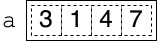

# Lists
Lists are a fundamental data structure in Python.

## Initialization
The simplest way to create a list in Python is to assign a variable a composite literal consisting of a comma-separated list of values between a pair of square brackets:
```python
a = [3, 1, 4, 7]
```

This list would look like this:



While the distinction is irrelevant in *most* situations, technically, the list contains references to the objects inside it. See the page about [references](references.md) for more details.

You can initialize a list with values other than integers.
```python
names = ['Akiko', 'Bob', 'Ciara']
truths = [True, True, False]
temps = [73.8, 82.3, 83.0]
```

## Operations
Python supports a typical range of operations on lists.

Expression | Value | New contents of `a`
-|-|-
`len(a)` | `4` | same
`a.pop()` | `7` | `[3, 1, 4]`
`a.append(6)` | `None` | `[3, 1, 4, 7, 6]`
`a.remove(4)` | `None` | `[3, 1, 7]`

## Lists vs. Arrays
Lists in Python also supports operations typically associated with [arrays](array_based.md).

### Indexing
List elements are numbered *starting at 0*. Thus, `a[0]` is the first element of `a`, `a[1]` is the second, and so on.

You can use this to access or change any element of a list. If we take our list above and set:
```python
a[2] = 8
```

then the list looks like this:


### Multidimensional Arrays
A structure like a matrix or a checkerboard is often represented as a multidimensional array. Such an array can be created using a list of lists:
```python
m = [[3, 1, 5, 1],
     [8, 3, 6, 0],
     [5, 3, 9, 2]]
```

To access a particular element of `m`, it might be best to continue with the array metaphor where you specify first the row, then the column. For instance, the expression `m[1][2]` refers to the value `6` in the structure above.

## Slices
*Slicing* is the action of getting a *copy* of a contiguous sequence of elements within a list into a new list. For instance, the expression `a[i:j]` returns a new list whose elements are `a[i]`, `a[i + 1]`, `a[i + 2]`, ..., `a[j - 1]`. If you omit the first argument of the slice (i.e., `a[:j]`), then you get a new list whose elements are `a[0]` through `a[j - 1]`. Likewise, if you omit second argument (i.e., `a[i:]`), then you get a new list with elements `a[i]` through `a[len(a) - 1]`.

## Resource
- Sedgewick, Wayne, and Dondero, *Introduction to Programming in Python*, [Section 1.4](https://introcs.cs.princeton.edu/python/14array/)

## Questions
1. :star: Can a list have length 0?
1. :star: What is the index of the *last* element of a list `a`?
1. :star: Given
    ```python
    m = [[0, 0], [0, 0], [0,0]]
    ```
    what is `len(m)`?
1. :star: Given
    ```python
    m = [[0, 0], [0, 0], [0,0]]
    ```
    what is `len(m[0])`?
1. :star: How would you initialize a three-dimensional array of floats?
1. :star: How many elements are in a two-dimensional array with seven rows and five columns?
1. :star: Is there a good way to remember that it's rows, columns and not the other way around?
1. :star: How can you determine the number of *columns* in a two-dimensional array `m`?
1. :star: Assuming `a` is a list, what is the result of evaluating the expression `a[:]`
1. :star: How do I get a new list whose elements are copies of the first three elements of list `a`?
1. :star: How do I get a new list whose elements are copies of the last three elements of list `a`?

## Answers
1. Yes, `len([])` is zero.
1. `len(a) - 1`. This is because indices start at 0; if there are 10 elements, they are numbered 0 through 9. Note also that Python lets you index elements relative to the end of a list with negative numbers. So, for instance, `a[-1]` refers to the last element of list `a`.
1. `3`, which is the number of rows.
1. `2`, which is the number of columns.
1. With three levels of nested square brackets. For instance, the following is a 3×3×2 array of floats: `[[[1., 2., 3.], [4., 5., 6.]], [[11., 12., 13.],[14., 15., 16.]]]`.
1. `35`, which is the product of the dimensions.
1. Think of a can of [RC Cola](https://en.wikipedia.org/wiki/RC_Cola).
1. `len(m[0])`.
1. You get a new list whose elements are a copy of the entire contents of list `a`.
1. `a[:3]`
1. `a[len(a) - 3:]` or more simply `a[-3:]`
