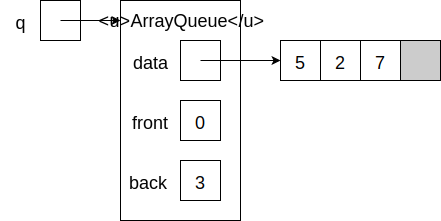
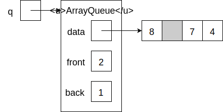

# Queues
## Abstract Data Type

A *queue* (pronounced like the letter Q) is similar to a [stack](stacks.md), but items are added at one end (the back) and removed from the other (the front). The metaphor is a line of people waiting to buy tickets: new people arrive at the back and (after buying their tickets) leave from the front. Britons call such a line a queue and will talk about "queuing up". Because items leave in the same order they arrive, queues are *first in, first out* (FIFO).

The operations are:

- `dequeue` (pronounced DQ) removes and returns the front item from the queue
- `enqueue` (pronounced NQ) adds an item to the back of the queue
- `is_empty` returns `True`` if the queue is empty

## Array-Based Implementation
The array-based implementation is similar to the array-implementation of a stack, with the front of the queue at index 0, but there are complications.

Enqueuing works just like pushing at first. To dequeue, you need to return the item at index 0, but then what? You could shift everything over (and decrement `_count`) so that that the queue begins at index 0, but that would take linear time. A better solution is to maintain two integers, `_front` and `_back`. The front item is at index `_front` and the next available index is `_back`.

This approach causes another problem: after a series of enqueue and dequeue operations, the queue will march down the array, so the indices close to 0 are unused but unavailable. To avoid wasting space, the queue is made to wrap around to the beginning. This is done using the `%` (remainder) operator.

The last detail is that a full queue (requiring copying everything into a larger array) and an empty queue look exactly the same: `_front == _back`. A solution is to set the integers `_front` and `_back` to None when the queue is empty.

Here is the code that rely on the [fixed-size array collection](stacks.md#fixed-size-array) described on the [stacks page](stacks.md):

```python
from array import Array
from empty_queue_exception import EmptyQueueException

class ArrayQueue:
    def __init__(self):
        self._data = Array(1)
        self._front = None
        self._back = None

    def dequeue(self):
        if self._front is None:
            raise EmptyQueueException()
        result = self._data[self._front]
        self._front = (self._front + 1) % len(self._data)
        if self._back == self._front:
            self._back = None
            self._front = None
        return result

    def enqueue(self, item):
        if not self._front is None and self._back == self._front:
            self._resize(len(self._data) * 2)
        if self._front is None:
            self._front = 0
            self._back = 0
        self._data[self._back] = item
        self._back = (self._back + 1) % len(self._data)

    def is_empty(self):
        return self._front is None

    def _resize(self, new_size):
        new_data = Array(new_size)
        for i in range(len(self._data)):
            new_data[i] = self._data[(self._front + i) % len(self._data)]
	    self._front = 0
        self._back = len(self._data)
	    self._data = new_data
```

The amortized running time for all of the queue operations is constant.

## Linked Implementation
The linked implementation is similar to the [linked implementation of a stack](stacks.md#linked-implementation), with the first node at the front.

Dequeuing is like popping.

Enqueuing involves adding a new successor to the *last* node in the chain. Normally finding this node requires walking down the chain, which would take linear time. A better solution is to maintain a second reference to the last node.

Here is the code:

```python
from empty_queue_exception import EmptyQueueException

class LinkedQueue:
    def __init__(self):
        self._front = None
        self._back = None

    def dequeue(self):
        if self._front is None:
            raise EmptyQueueException()
        result = self._front._item
        self._front = self._front._next
        return result

    def enqueue(self, item):
        if self._front is None:
            self._front = self.Node(item)
            self._back = self._front
        else:
            self._back._next = self.Node(item)
            self._back = self._back._next

    def is_empty(self):
        return self._front is None

    class Node:
        def __init__(self, item):
            self._item = item
            self._next = None
```

All operations take constant time.

## Resource
- Sedgewick, Wayne, and Dondero, *Introduction to Programming in Python*, [Section 4.3](https://introcs.cs.princeton.edu/python/43stack/)

## Questions
1. :star: What is the difference between a stack and a queue?
1. :star::star: Here is an array-based queue:

    
    
    Draw the final state of the queue after executing the following sequence of operations:
    ```python
    q.enqueue(4)
    q.dequeue()
    q.dequeue()
    q.enqueue(8)
    ```
1. :star::star: What does the code below do?
    ```python
    from linked_queue import LinkedQueue
    with open('file.txt') as f:
        q = LinkedQueue()
        for line in f:
            q.enqueue(line)
        while not q.is_empty():
            print(q.dequeue(), end='')
    ```

## Answers
1. A stack is last in, first out and a queue is first in, first out.
1. &nbsp;
    
1. It prints the lines of `file.txt` in their original order.
