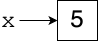
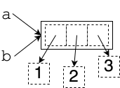

# References
## Overview
Recall that a [variable](variables.md) holds *exactly one thing*. So if you have:
```python
x = 5
```

you can visualize this variable definition as follows:


This approximation is satisfactory in many situations. But more precisely, Python stores every values in objects, and variables hold references to these objects rather than storing actual values directly. So the more accurate visualization of the code snippet above is as follows:



In other words, the variable contains a *reference* to an object and not directly the value held in the object. This is a realization of a famous adage in our field: all computer science problems can be solved by another level of indirection (this famous quote is attributed to [Butler Lampson](https://en.wikipedia.org/wiki/Butler_Lampson)). What problem is being solved here, you might ask? For one thing, when passing a value to a function, you do not need copy the entire contents of the object (which can be very large), you only need to pass a reference to it.

You can think of a reference as an arrow pointing to the object. For example, if you have:
```python
x = [6, 2, 5]
```
then pictorially:


The reference points to the entire object, not any particular part of it.

## Assignment and Aliases
The `=` assignment operator copies a reference, not the content of an object.

Now that we are aware of references, an assignment still makes a copy, but with our new understanding that means copying the *reference*, not the object on the other end. For example, if you have:
```python
a = [1, 2, 3]
b = a
```

then you get two references to the same list:



`a` and `b` are said to be *aliases* because they refer to the same list. A consequence of aliasing is that, if you modify the list to which `a` refers, you are also modifying the list to which `b` refers (because they're the same one and lists are mutable).

### Functions Modifying Their Arguments
Functions receive a copy of their arguments. But this copy must be viewed under the lens of references. What is being copied is not the value (i.e., the contents of the object) but rather the reference to the value.

For illustration, let us look what happens if a function has received a value of a mutable type as an argument. We still have:
```python
a = [1, 2, 3]
b = a
```

But consider:
```python
def f(x):
    x[0] = 3
```

and then you:
```python
f(a)
```

then both lists `a` and `b` are modified, because variables `a` and `b` are aliases.

## Equality
References make the notion of equality more complex.

Consider the following snippet of code:
```python
a = [1, 2, 3]
b = a
c = [1, 2, 3]
```

Precisely, in the first statement, a new object is created, its type is a list of integers, its size is 3, its elements are initialized to `1`, `2`, and `3`, in that order, and a reference to that object is stored in the variable `a`. However, this is a mouthful, so we will often just say that `a` is assigned a list `[1, 2, 3]`. But remember that the latter description is an approximation, a shortcut.

Memory now looks like this:


Then `a == b` and `a == c` because the `==` operator asks whether its two operands refer to objects with the same *contents*. This is usually the preferred way to compare objects. This type of equality checking is sometimes referred to as *object equality* or *value equality*.

There are circumstances when we are interested in establishing if two variables hold the same reference. In this case, we need to use the `is` operator. With our example, the expression `a is b` returns `True` because `a` and `b` are aliases, but the expression `a is c` returns `False` even though both `a` and `c` refer to the same contents. This type of equality checking is sometimes referred to as *reference equality* or *identity equality*.

## None
The literal value `None` is a reference to nothing. Its type is `NoneType`. If you:
```python
x = None
```

then `x` doesn't refer to anything. In these pages, we will denote this with a line ending with a bullet:


Trying to do anything with `s`, such as evaluating `s.lower()`, results in an `AttributeError`, raised at run time, because there are no methods associated with `None`.

You can check if a variable refers to nothing with the `is` operator. Suppose you wish to check if `x` points to nothing, then you can use the expression `x is None`.

## Garbage Collection
Every object takes up memory. As soon as an object is unreachable (that is, there are no more references to it), that object becomes a candidate in a process that reclaims the corresponding memory. This process is called *garbage collection*.

This feature of Python is in contrast to C, where it is the programmer's responsibility to free objects when they are no longer needed. A C programmer who does not manage memory with extreme care can end up with a *memory leak*, where unreachable objects take up more and more memory until the system crashes, or a *dangling pointer*, where a reference points to a location in memory that does not contain the intended object. Either of these bugs can be exceedingly difficult to detect and to fix.

## Resources
- Sedgewick, Wayne. and Dondero, *Introduction to Programming in Python*, [Section 3.1](https://introcs.cs.princeton.edu/python/31datatype/)
- Draper, [The Worst Mistake of Computer Science](https://www.lucidchart.com/techblog/2015/08/31/the-worst-mistake-of-computer-science/)

## Questions
1. :star: What is the term for two references to the same object?
1. :star: Which Python types use references?
1. :star: Is it possible to create a dangling pointer in Python?
1. :star::star: Is it possible to create a memory leak in Python?
1. :star::star: If you define `s = None`, does `s is None` return `True`?
1. :star::star: If you define `s = None`, is `s == None`?
1. :star::star: Suppose you execute the following code (assuming Point is a class with well-defined `__eq__` and `__ne__` methods):
    ```python
    a = Point(1, 2)
    b = Point(1, 2)
    c = b
    ```
    1. Does `a == b` return `True`?
    1. Does `a is b` return `True`?
    1. Does `b == c` return `True`?
    1. Does `b is c` return `True`?
1. :star::star: If you have:
    ```python
    a = [1, 2, 3]
    b = a
    a[1] = 5
    ```
    then what is the value of `b[1]`?
1. :star::star: Suppose you have defined
    ```python
    def alter1(a):
        a[0] = 5
    ```
    and then you:
    ```python
    b = [1, 2, 3, 4]
    alter1(b)
    ```
    What are the elements of `b` afterward?
1. :star::star: Suppose you have defined
    ```python
    def alter2(a):
        a = [5, 6, 7, 8]
    ```
    and then you:
    ```python
    b = [1, 2, 3, 4]
    alter2(b)
    ```
    What are the elements of `b` afterward?
1. :star::star::star: What's the difference between a reference and a pointer?
1. :star::star::star: How can you tell if two lists `a` and `b` have the same contents?
1. :star::star::star: What type is the literal value `None`?

## Answers
1. Aliases.
1. All Python types use references.
1. No. The only way to get a reference is to create a new object through a literal, sequence creation, or calling a constructor. The only way to get rid of an object is to set the last reference to it to `None` or another object.
1. Not strictly speaking; you can't have an object that is truly unreachable. If, however, you stored extra references to objects in a list and then changed the original references, the objects would still be reachable and they would therefore not be garbage collected.
1. Yes. Evaluation of this expression doesn't cause an AttributeError because this check doesn't look at what's on the other end of the reference.
1. Yes. `==` compares the contents of the box for `s` to the literal value `None` and determines that they're the same. Evaluation of this expression doesn't cause an AttributeError because this check doesn't look at what's on the other end of the reference. Note that idiomatic Python prefers the expression `s is None` for this purpose.
1.
    1. Yes (`a` and `b` have the same contents)
    1. No (`a` and `b` refer to different objects)
    1. Yes (`b` and `c` have the same contents)
    1. Yes (`b` and `c` refer to the same object)
1. 5, because `a` and `b` are aliases. There is only one list, which can be accessed via either reference.
1. 5, 2, 3, 4. Since `a` and `b` refer to the same list, alterations to the list on the other end of the reference are visible from either variable.
1. 1, 2, 3, 4. Making the local variable `a` point to a new list does not affect the external variable `b`.
1. Some sources will use these two words interchangeably. Indeed, a pointer (which is the address of a location in memory) is one way for a compiler to implement a reference. Other sources will insist that it's only a pointer if you have access to the address and can perform arithmetic on it to, for example, find the next consecutive location in memory. This is what people mean when they say, "C has pointers but Python does not." The designers of Python felt that the few additional shortcuts you can take with "true" pointers aren't worth the subtle and frustrating bugs that can result from messing with addresses directly.
1. `a == b`. The expression `a is b` will not yield the right answer if `a` and `b` are not aliases.
1. `None` has its own type, called `NoneType`. `None` is the only value of that type. While many programming languages have such a special value, some computer scientists consider it [a bad idea](https://www.lucidchart.com/techblog/2015/08/31/the-worst-mistake-of-computer-science/).
