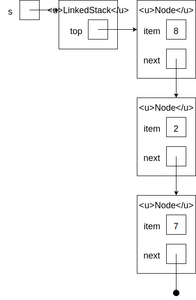

# Stacks
## Abstract Data Type
An *abstract data type* defines a data type and associated operations. It does not say anything about how these operations are implemented; it merely conveys the idea of the data type.

The *stack* abstract data type defines a stack as a vertical sequence of items, with the following operations:
- `is_empty` returns `True` if the stack is empty
- `pop` removes and returns the top item from the stack
- `push` adds an item to the top of the stack

The standard metaphor for a stack is one of those spring-loaded stacks of plates you might find in a cafeteria. You can push a new plate onto the stack or pop one off the top, but there's no way to access the plates underneath. The sequence of previously-viewed pages that your web browser maintains to allow you to go back is also represented as a stack.

Because the last item pushed onto a stack will be the first one popped, stacks are said to be *last in, first out* (LIFO).

As described below, Python lists can function as stacks. A stack can also be implemented using an array-based or linked data structure.

## Analysis

All of the stack operations take constant time. This analysis is worst-case for an linked implementation but (except for `is_empty`) only amortized for an array-based implementation. The default Python implementation discussed below is array-based.

A stack holding $n$ items uses space in $\Theta(n)$.

## Python Lists as Stacks

Python lists provide all of the stack operations, although `push` is called `append`.

| **Abstract data type operation** | **List operation** |
|--|--|
|`s.is_empty()`|`s == []`|
|`s.push(x)`|`s.append(x)`|
|`s.pop()`|`s.pop()`|

Since the empty list is considered falsy, you can simply say `if s: ...` instead of `if s == []: ...`.

## Array-Based Implementation
The items in the stack can be kept in an array. The only catch is that an array has typically a fixed size, while a stack can grow and shrink as items are pushed and popped. Two simple tricks deal with this problem:
- Maintain an instance variable `count` indicating how many items are currently in the stack. Thus, even if the array has room for 8 items, if `count` is 5, only the first 5 items are considered part of the stack.
- If anyone tries to push onto a full stack, copy all of the current items into a new, larger array first.

Here is code for the array-based implementation:
```python
from array import Array
from empty_stack_exception import EmptyStackException

class ArrayStack:
    def __init__(self):
        self._data = Array(1)
        self._count = 0

    def push(self, item):
        if self._count == len(self._data):
            self._resize(self._count * 2)
        self._data[self._count] = item
        self._count += 1

    def pop(self):
        if self._count == 0:
            raise EmptyStackException()
        self._count -= 1
        return self._data[self._count]

    def is_empty(self):
        return self._count == 0

    def _resize(self, new_size):
        new_data = Array(new_size)
        for i in range(self._count):
            new_data[i] = self._data[i]
        self._data = new_data
```

Clearly the `is_empty` and `pop` operations take constant time.

`push` takes constant time in the best case, but in the worst case (when the array was full) it takes linear time to copy all of the items currently in the stack into the larger array. It turns out that `push` takes constant [amortized time](../algorithms/analysis.md#best-case-average-worst-case-and-amortized-analysis) if, as in the code above, the array capacity is *doubled* every time it is expanded. Then, when pushing *n* items in a row (which is the worst case), the total amount of copying is

1 + 2 + 4 + 8 + ... + *n* < 2*n*

or less than 2 copies (constant) per item.

The code above relies on a fixed-size array and the ability to raise an exception.

### Fixed-Size Array
Here is code for a fixed-size array:
```python
class Array:
    def __init__(self, capacity):
        self.__data = [0] * capacity

    def __len__(self):
        return len(self.__data)

    def __getitem__(self, index):
        if not isinstance(index, int):
            raise TypeError('Array index must be an int')
        return self.__data[index]

    def __setitem__(self, index, value):
        if not isinstance(index, int):
            raise TypeError('Array index must be an int')
        self.__data[index] = value

    def __repr__(self):
        return self.__data.__repr__()

    def __str__(self):
        return self.__data.__str__()
```

### Empty-Stack Exception
Here is code for an empty-stack exception; it is just an empty class derived from the `Exception` base class:
```python
class EmptyStackException(Exception):
    pass
```

## Linked Implementation
A linked implementation uses a chain of [linked list](linked_lists.md) nodes. The LinkedStack object knows about the top node, which knows about the next node, and so on. Here is the code:
```python
from empty_stack_exception import EmptyStackException

class LinkedStack:
    def __init__(self):
        self._top = None

    def push(self, item):
        self._top = self.Node(item, self._top)

    def pop(self):
        if self._top is None:
            raise EmptyStackException()
        result = self._top.item
        self._top = self._top.next
        return result

    def is_empty(self):
        return self._top is None

    class Node:
        def __init__(self, item, next):
            self.item = item
            self.next = next
```

All three stack methods take constant time.

## Resource
- Sedgewick, Wayne, and Dondero, *Introduction to Programming in Python*, [Section 4.3](https://introcs.cs.princeton.edu/python/43stack/)

## Questions
1. :star: In the array-based implementation, does `count` indicate the index of the current top item or the index of the next item to be pushed?
1. :star: What is the amortized running time of all three stack operations in both array-based and linked implementations?
1. :star::star: Here is a linked stack:

    
    
    Draw the final state of the stack after executing the following sequence of operations:
    ```python
    s.push(4)
    s.pop()
    s.pop()
    s.push(8)
    ```
1. :star::star: It would save space to replace the expression `data.count * 2` in the `push` method of `ArrayStack` with `data.count + 1`. What effect would this have on the amortized running time of `push`?
1. :star::star: What does the code below do?
    ```python
    from array_stack import ArrayStack
    with open('file.txt') as f:
        s = ArrayStack()
        for line in f:
            s.push(line)
        while not s.is_empty():
            print(s.pop(), end='')
    ```

## Answers
1. The next item to be pushed. The current top item, if there is one, is at index `count - 1`.
1. Constant.
1. &nbsp;
    
1. The total amount of copying in pushing *n* items would become

    1 + 2 + 3 + ... + *n* = *n*(*n* + 1) / 2
    
    which is (*n* + 1) / 2 copies per item. The amortized time is therefore linear.
1. It prints the lines of `file.txt` in reverse order.
