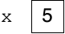

# Variables
## Overview
In computer science, a *variable* is a named location to store a value. (Mathematicians and statisticians use the word in slightly different ways.)

In Python, it is imprecise but convenient to think of a variable as a labeled box that holds something:


Before the variable can be used, it must be *initialized*, that is, assigned an initial value:
```python
x = 5
```
Now there's something in the box:



A variable is also assigned a type, depending on the value stored in it. If the assigned value is of type `float`, then the variable has type `float`. If the assigned value is of type `int`, then the variable has type `int`. Et cetera.

Once the variable is initialized, the box always contains *exactly one value*. It can't be empty and it can't contain more than one value.

The variable, as an expression, now stands for its stored value, so we can do things like:
```python
print(x)
```

The variable can be given a different value, replacing what was in the box, with an assignment statement:
```python
x = -17
```

In fact, we can even replace the original value with a value of a different type:
```python
x = 'abc'
```

The type associated with variable `x` then changes from `int` to `str`.

The mental model for variables described so far is convenient but imprecise. Python uses objects to represent all values and ties variables with those objects through references as explained in details [elsewhere](references.md).

### Scope
The *scope* of a variable is the region of code where the variable can be accessed. Python distinguishes between *local* and *global* scope. The scope of local variables and function parameters is the entire function (local scope). The scope of global variables is the entire file which contains the variables (global scope).

## Resource
- Sedgewick, Wayne, and Dondero, *Introduction to Programming in Python*, [Section 1.2](https://introcs.cs.princeton.edu/python/12types/)

## Questions
1. :star: Explain the difference between `x = y` and `x == y`.
1. :star: Is the following code legal?
    ```python
    x = 2
    x = 3
    ```
1. :star: Is the following code legal?
    ```python
    x = 2
    x = 'abc'
    ```
1. :star: Is the following code legal?
    ```python
    variable = 2
    VARIABLE = 3
    ```
1. :star: What is the scope of variable `g` in the following code snippet?
   ```python
   g = -1
   def fac(n):
       p = 1
       for i in range(1, n + 1):
           p = p * i
       return p
   ```
1. :star: What is the scope of variable `n` in the following code snippet?
   ```python
   g = -1
   def fac(n):
       p = 1
       for i in range(1, n + 1):
           p = p * i
       return p
   ```
1. :star: What is the scope of variable `i` in the following code snippet?
   ```python
   g = -1
   def fac(n):
       p = 1
       for i in range(1, n + 1):
           p = p * i
       return p
   ```
1. :star::star: If `alive` is a boolean variable, how can `alive == True` be replaced with a shorter expression?
1. :star::star: If `alive` is a boolean variable, how can `alive == False` be replaced with a shorter expression?
1. :star::star: Do `x = y` and `y = x` mean the same thing?
1. :star::star: Is `3 = x` a legal statement?
1. :star::star: How would you swap the values of two variables `x` and `y`?
1. :star::star::star: How would you swap the values of two variables `x` and `y` *without using a third variable*?
1. :star::star::star: Is `a = b = c` a legal statement?

## Answers
1. `x = y` is a statement that causes `x` to contain a copy of the value of `y`. `x == y` is a boolean expression that is true if and only if `x` and `y` contain the same value.
1. Yes. It doesn't make sense as algebra, where the `=` symbol is used to *state* that two expressions are equal, but it's fine in Python. It creates a variable `x`, assigns it the value 2, and then replaces that value with 3.
1. Yes. Python allows a variable to hold values of different types over time.
1. Yes. Since Python is case-sensitive, `variable` and `VARIABLE` are different variables.
1. The scope of `g` is the entire file in which `g` and `fac` are defined.
1. The scope of `n` is the entire function `fac`.
1. The scope of `i` is the entire function `fac`.
1. If `alive == True`, `alive` is true; if not, `alive` is false. In other words, `alive` and `alive == True` always have exactly the same value. The shorter version is always preferable as it is clearer, is more concise, and avoids the risk of accidentally typing `alive = True` (which is an assignment, not a comparison).
1. `not alive`
1. No. If `x` was 1 and `y` was 2, then `x = y` would change `x`'s value to 2, but `y = x` would change `y`'s value to 1.
1. No. The value on the left side of an assignment statement must be a variable (or some other place where a value can be stored, like an array element).
1. Many programmers would use the following code sequence:
    ```python
    temp = x
    x = y
    y = temp
    ```
    To remember this, imagine that you have an object (say, a can of beans) in each hand. To swap them, you put one down on the table, move the other one to your newly-empty hand, and then pick up the one on the table. This analogy is slightly strained because `temp = x` doesn't empty out `x`, it just copies the value of `x` into `temp`.
1.  You can use the comma operator:
    ```python
    x, y = y, x
    ```
    Surprisingly, you can also accomplish this (for integer types) using the bitwise xor operator:
    ```python
    x = x ^ y
    y = x ^ y
    x = x ^ y
    ```
    For boolean variables, you could do the same thing with the logical xor operator `!=`.
1. Yes. Python allows the value of an expression to be assigned to a list of target variables. This statement evaluates the expression on the right and stores its value in all the variables listed on the left.
