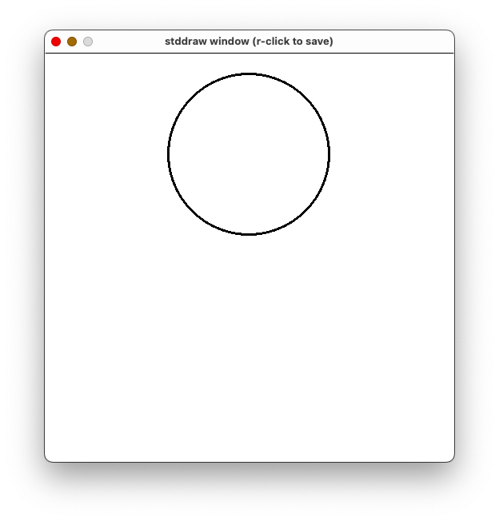

# `stdlib`
## Overview
The Princeton Standard Library, also known as `stdlib`, is a collection of Python modules developed by Robert Sedgewick, Kevin Wayne, and Robert Dondero to make certain tasks easier, particularly as graphics is concerned. Installation is [relatively straightforward](https://introcs.cs.princeton.edu/python/mac/). (At the moment, only instructions to install the library on Mac OS X are described. It appears that the same steps with the obvious modifications work also on Linux-based installations.)

## Graphics
While it would not be a good choice for building a complicated user interface, `stdlib` is *much* easier to use than other frameworks for creating simple diagrams, animations, and games.

A wide variety of functions are available in the `stddraw` module. For example, the following code sequence:
```python
stddraw.circle(0.5, 0.75, 0.2)
stddraw.show()
```

creates this picture:


The three arguments in the case are the *x* coordinate, the *y* coordinate, and the radius.

*x* ranges from 0.0 on the left to 1.0 on the right; *y* ranges from 0.0 at the bottom to 1.0 at the top. This is what you're probably used to from plotting curves in mathematics, but differs from some other computer graphics systems (which measure *y* from the top down).

### Animation
If you are doing animation, start each pass through your loop with
```python
stddraw.clear()
```

to clear the window, redraw *everything*, and then
```python
stddraw.show(0)
```

The function `stddraw.show`, which takes an optional number of milliseconds as an argument, is vital for adjusting the speed of your animation.

### Mouse Input
The functions for detecting mouse and keyboard events are, perhaps surprisingly, in the `stddraw` module.

To detect a mouse click:
```python
while not stddraw.mousepressed():
    # Wait for mouse to be pressed
    # (A call to show may be necessary to work around a potential bug.)
    stddraw.show(0)

x = stddraw.mousex()
y = stddraw.mousey()

while stddraw.mousepressed():
    # Wait for mouse to be released
    pass
```

Now `x` and `y` hold the coordinates of the location where the mouse was clicked.

## Resource
- [stdlib documentation](https://introcs.cs.princeton.edu/python/code/)

## Questions
1. :star::star: Why aren't we using real Python?
1. :star::star: How would you generate the result of rolling a fair, six-sided die?
1. :star::star: Why doesn't the code below draw anything?
    ```python
    stddraw.filledRectangle(0.5, 0.5, 0.1, 0.3)
    ```
1. :star::star::star: Write a program that draws a dot and moves it left or right a little each time the user presses and releases 'a' or 'd', respectively.
## Answers
1. This is real Python; nothing about the language has changed. We are simply using a library that someone else has written so that we don't have to write a bunch of tedious code that isn't relevant to the topics we're studying.
1.
    ```python
    roll = random.randint(1, 6)
    ```
    or
    ```python
    roll = random.randrange(6) + 1
    ```
1. It must be followed by a call to `stddraw.show`.
1.
    ```python
    import stddraw

    x = 0.5
    while True:
        stddraw.clear()
        stddraw.filledCircle(x, 0.5, 0.1)
        stddraw.show(0)
        while not stddraw.hasNextKeyTyped():
            stddraw.show(0)
        c = stddraw.nextKeyTyped()
        if c == 'a':
            x -= 0.1
        elif c == 'd':
            x += 0.1
    ```
